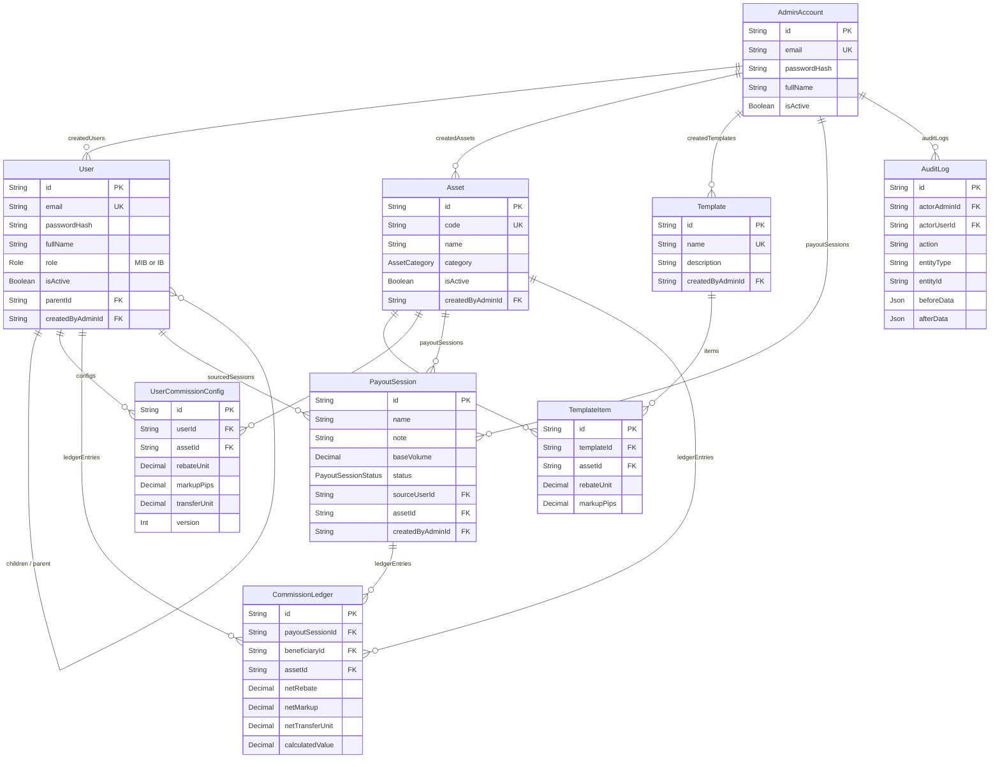

# Entity Relationship Diagram (ERD)

```mermaid
erDiagram
    AdminAccount ||--o{ User : "createdUsers"
    AdminAccount ||--o{ Asset : "createdAssets"
    AdminAccount ||--o{ Template : "createdTemplates"
    AdminAccount ||--o{ PayoutSession : "payoutSessions"
    AdminAccount ||--o{ AuditLog : "auditLogs"

    User ||--o{ User : "children / parent"
    User ||--o{ UserCommissionConfig : "configs"
    User ||--o{ CommissionLedger : "ledgerEntries"
    User ||--o{ PayoutSession : "sourcedSessions"

    Asset ||--o{ TemplateItem : "templateItems"
    Asset ||--o{ UserCommissionConfig : "configs"
    Asset ||--o{ PayoutSession : "payoutSessions"
    Asset ||--o{ CommissionLedger : "ledgerEntries"

    Template ||--o{ TemplateItem : "items"

    PayoutSession ||--o{ CommissionLedger : "ledgerEntries"

    AdminAccount {
        String id PK
        String email UK
        String passwordHash
        String fullName
        Boolean isActive
    }

    User {
        String id PK
        String email UK
        String passwordHash
        String fullName
        Role role "MIB or IB"
        Boolean isActive
        String parentId FK
        String createdByAdminId FK
    }

    Asset {
        String id PK
        String code UK
        String name
        AssetCategory category
        Boolean isActive
        String createdByAdminId FK
    }

    Template {
        String id PK
        String name UK
        String description
        String createdByAdminId FK
    }

    TemplateItem {
        String id PK
        String templateId FK
        String assetId FK
        Decimal rebateUnit
        Decimal markupPips
    }

    UserCommissionConfig {
        String id PK
        String userId FK
        String assetId FK
        Decimal rebateUnit
        Decimal markupPips
        Decimal transferUnit
        Int version
    }

    PayoutSession {
        String id PK
        String name
        String note
        Decimal baseVolume
        PayoutSessionStatus status
        String sourceUserId FK
        String assetId FK
        String createdByAdminId FK
    }

    CommissionLedger {
        String id PK
        String payoutSessionId FK
        String beneficiaryId FK
        String assetId FK
        Decimal netRebate
        Decimal netMarkup
        Decimal netTransferUnit
        Decimal calculatedValue
    }

    AuditLog {
        String id PK
        String actorAdminId FK
        String actorUserId FK
        String action
        String entityType
        String entityId
        Json beforeData
        Json afterData
    }
```
